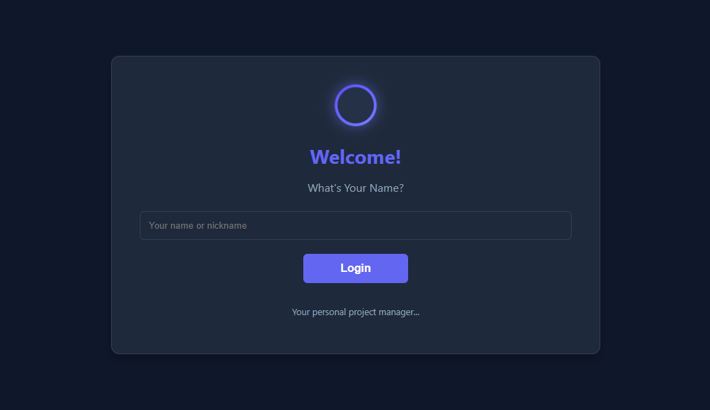
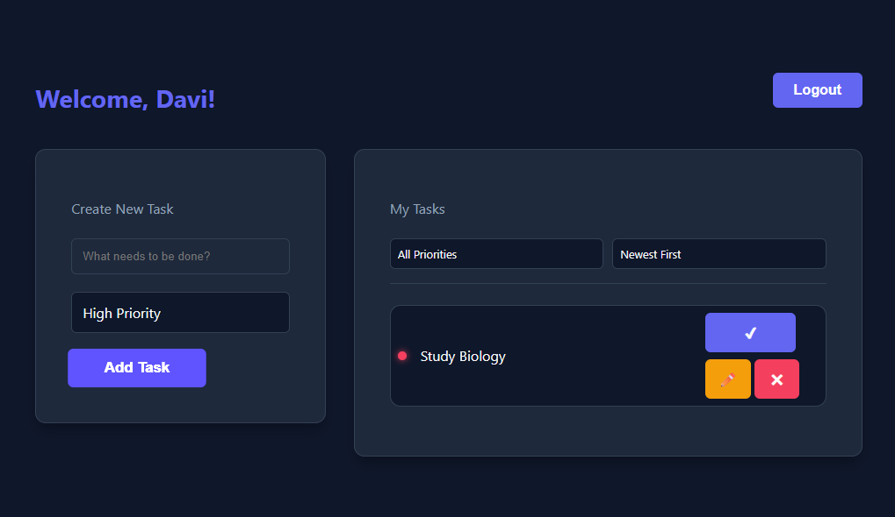

# TaskFlow ✨

<div align="center">


**A sleek, modern task manager built for productivity enthusiasts**

[](https://developer.mozilla.org/en-US/docs/Web/HTML)
[](https://developer.mozilla.org/en-US/docs/Web/CSS)
[](https://developer.mozilla.org/en-US/docs/Web/JavaScript)
[](https://opensource.org/licenses/MIT)

[Live Demo](https://daviresende123.github.io/TaskFlow/) · [Report Bug](https://github.com/daviresende123/TaskFlow/issues/new) · [Request Feature](https://github.com/daviresende123/TaskFlow/issues/new)

</div>

---

## 📋 Table of Contents

- [About The Project](#-about-the-project)
- [Features](#-features)
- [Demo](#-demo)
- [Architecture](#-architecture)
- [Getting Started](#-getting-started)
- [Usage](#-usage)
- [Code Highlights](#-code-highlights)
- [Roadmap](#-roadmap)
- [Contributing](#-contributing)
- [License](#-license)
- [Contact](#-contact)

---

## 🎯 About The Project

**TaskFlow** is a modern, intuitive task management application designed specifically for students and developers who need to stay organized and productive. Built with vanilla JavaScript and a focus on clean architecture, TaskFlow demonstrates professional-grade frontend development practices while maintaining simplicity and performance.

### Why TaskFlow?

- **Beautiful UI/UX** - Dark mode interface with smooth animations and micro-interactions
- **Zero Dependencies** - Pure vanilla JavaScript - no frameworks, no bloat
- **Persistent Storage** - All your tasks saved locally using LocalStorage API
- **Fully Responsive** - Seamless experience across desktop, tablet, and mobile devices
- **Accessible** - WCAG compliant with proper ARIA labels and keyboard navigation
- **Secure** - Content Security Policy implemented for enhanced security

---

## ✨ Features

### Core Functionality

- **Full CRUD Operations** - Create, Read, Update, and Delete tasks effortlessly
- **Priority System** - Organize tasks with Low, Medium, and High priority levels
- **Advanced Filtering** - Filter by priority or view completed tasks
- **Smart Sorting** - Sort by date (newest/oldest) or priority level
- **Inline Editing** - Edit tasks directly in the list without modal dialogs
- **User Profiles** - Personalized greeting with name persistence

### Technical Features

- **Modular Architecture** - Clean separation of concerns with organized code structure
- **Input Validation** - Real-time sanitization and validation of user inputs
- **Smooth Animations** - CSS transitions and keyframe animations for polished UX
- **Design System** - CSS custom properties for consistent theming
- **Local Storage Management** - Robust error handling for storage operations
- **Configuration System** - Centralized constants for easy maintenance

---

## 🎥 Demo

<div align="center">
  
  
</div>

---

## 🏗️ Architecture

TaskFlow follows a **modular architecture** with clear separation of concerns:

```
TaskFlow/
│
├── index.html              # Main HTML structure
├── styles/
│   └── style.css          # Complete styling with CSS variables
├── scripts/
│   └── scripts.js         # Modular JavaScript architecture
│
└── Architecture Components:
    ├── CONFIG             # Application constants and configuration
    ├── Storage            # LocalStorage abstraction layer
    ├── Validation         # Input validation and sanitization
    ├── TaskManager        # Task state management and business logic
    ├── UI                 # DOM manipulation and rendering
    ├── AuthController     # User authentication logic
    ├── TaskController     # Task CRUD operations controller
    └── EventListeners     # Centralized event handling
```

### Design Patterns Used

1. **Module Pattern** - Encapsulation of related functionality
2. **MVC Architecture** - Clear separation between data, logic, and presentation
3. **Singleton Pattern** - Single instance managers (TaskManager, Storage)
4. **Observer Pattern** - Event-driven UI updates

---

## 🚀 Getting Started

### Prerequisites

You only need a modern web browser! No build tools or dependencies required.

### Installation

1. **Clone the repository**

   ```bash
   git clone https://github.com/yourusername/taskflow.git
   ```

2. **Navigate to the project directory**

   ```bash
   cd taskflow
   ```

3. **Open in browser**

   ```bash
   # Option 1: Direct file opening
   open index.html

   # Option 2: Using Python HTTP server
   python -m http.server 8000

   # Option 3: Using Node.js http-server
   npx http-server
   ```

4. **Start managing tasks!** 🎉

---

## 💡 Usage

### Quick Start Guide

1. **Login** - Enter your name (2-21 characters, letters only)
2. **Create Task** - Type your task and select priority level
3. **Manage Tasks** - Mark complete (✔), edit (✏️), or delete (✖)
4. **Filter & Sort** - Use dropdowns to organize your task list
5. **Edit Inline** - Click edit to modify task text and priority
6. **Logout** - Your tasks are saved and will be there when you return!

### Keyboard Shortcuts

- `Enter` - Submit forms (login/create task)
- `Tab` - Navigate between form fields
- `Esc` - Cancel inline editing (planned feature)

---

## 💻 Code Highlights

### Modular Storage System

```javascript
const Storage = {
  get(key) {
    try {
      const item = localStorage.getItem(key);
      return key === CONFIG.STORAGE_KEYS.TASKS ? JSON.parse(item) || [] : item;
    } catch (error) {
      console.error(`Error reading from localStorage (${key}):`, error);
      return key === CONFIG.STORAGE_KEYS.TASKS ? [] : null;
    }
  },
  // ... more methods
};
```

### Real-time Input Sanitization

```javascript
DOM.usernameInput.addEventListener("input", function () {
  this.value = Validation.sanitizeName(this.value);
});
```

### Smart Task Filtering & Sorting

```javascript
const filteredTasks = TaskManager.getFiltered(priorityFilter);
const sortedTasks = TaskManager.getSorted(filteredTasks, sortOrder);
```

### CSS Custom Properties for Theming

```css
:root {
  --bg-color: #0f172a;
  --accent-primary: #6366f1;
  --status-high: #f43f5e;
  /* ... more variables */
}
```

---

## 🗺️ Roadmap

### Planned Features

- [ ] Dark/Light theme toggle
- [ ] Task categories/tags
- [ ] Due dates and reminders
- [ ] Task search functionality
- [ ] Drag & drop reordering
- [ ] Export tasks to JSON/CSV
- [ ] Cloud sync (Firebase integration)
- [ ] Pomodoro timer integration
- [ ] Task statistics dashboard
- [ ] Internationalization (i18n)

### Known Issues

- [ ] Standardize alert messages language (currently mixed PT/EN)
- [ ] Add confirmation dialog for task deletion
- [ ] Implement keyboard shortcut for edit cancellation

---

## 🤝 Contributing

Contributions are what make the open source community amazing! Any contributions you make are **greatly appreciated**.

1. Fork the Project
2. Create your Feature Branch (`git checkout -b feature/AmazingFeature`)
3. Commit your Changes (`git commit -m 'Add some AmazingFeature'`)
4. Push to the Branch (`git push origin feature/AmazingFeature`)
5. Open a Pull Request

Found a bug or want to suggest a feature?

1. Check if the issue already exists
2. If not, [open a new issue](https://github.com/daviresende123/TaskFlow/issues/new)
3. Provide as much detail as possible

All contributions are welcome! 🎉

---

## 📄 License

Distributed under the MIT License. See `LICENSE` for more information.

---

## 📞 Contact

**Davi Resende** - [@davirexx2](https://x.com/davirexx2) - davigomides161@gmail.com

---

## 🙏 Acknowledgments

- Design inspiration from modern task management tools
- Fonts from [Google Fonts - Inter](https://fonts.google.com/specimen/Inter)
- Color palette inspired by [Tailwind CSS](https://tailwindcss.com/docs/customizing-colors)

---

<div align="center">

**Built with ❤️ and lots of ☕**

If you found this project helpful, please consider giving it a ⭐!

[](https://github.com/yourusername/taskflow/stargazers)
[](https://github.com/yourusername/taskflow/network/members)

</div>
